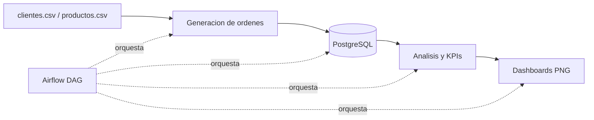

<div align="center">

# 📊 Data Pipeline de Ventas

### Orquestación batch de datos de ventas — extracción, calidad, KPIs y dashboards automatizados


</div>

---

## 🎯 Resumen

Pipeline de datos que simula el flujo real de una empresa: ingesta de clientes y productos, generación de órdenes, carga en PostgreSQL, cálculo de KPIs de ventas y generación automática de dashboards, todo orquestado con Apache Airflow.

## 🏗️ Arquitectura



## 📂 Estructura del proyecto

```
data-pipeline-ventas/
├── airflow/            pipeline_ventas.py (DAG principal)
├── dags/               carpeta usada por Airflow
├── data/               clientes.csv, productos.csv, ordenes.csv
├── docker/             docker-compose.yml, docker-compose-airflow.yml
├── reports/            top_clientes.png, top_productos.png, ventas_por_dia.png
├── scripts/            conexion_postgres.py, insertar_clientes.py, etl_productos.py, generar_ordenes.py, analisis_ventas.py, dashboard_ventas.py
├── requirements.txt
└── README.md
```

## 🚀 Cómo ejecutar

### 1. Clonar el repositorio
```bash
git clone https://github.com/CarlosGutierrezR/data-pipeline-ventas.git
cd data-pipeline-ventas
```

### 2. Levantar PostgreSQL + Adminer
```bash
cd docker
docker compose up -d
```
Adminer: http://localhost:8080

**⚠️ Nota:** credenciales de ejemplo para este entorno local de práctica, no usar en producción.

| Campo | Valor |
|---|---|
| Servidor | postgres |
| Usuario | admin |
| Contraseña | admin |
| Base de datos | ventasdb |

### 3. Levantar Airflow
```bash
docker compose -f docker-compose-airflow.yml up -d
```
Airflow: http://localhost:8081 (usuario/contraseña de ejemplo: airflow / airflow, solo entorno local)

### 4. Ejecutar el pipeline
En la UI de Airflow: buscar el DAG pipeline_ventas, activarlo y pulsar Trigger DAG.

Esto ejecuta automáticamente: inserción de clientes, inserción de productos, generación de órdenes, ETL hacia PostgreSQL, análisis de KPIs y dashboards en PNG.

## 📊 Scripts y reportes

| Script | Función |
|---|---|
| conexion_postgres.py | Conexión centralizada a PostgreSQL |
| insertar_clientes.py | Poblar tabla de clientes |
| etl_productos.py | Poblar tabla de productos |
| generar_ordenes.py | Crear órdenes aleatorias |
| analisis_ventas.py | Cálculo de KPIs y métricas |
| dashboard_ventas.py | Generación de gráficos PNG |
| pipeline_ventas.py | Orquestación completa en Airflow |

Salidas en /reports/: top 5 clientes, productos más vendidos, ventas totales por día.

## ⚙️ Tecnologías

Apache Airflow 2.6.3, PostgreSQL 13, Docker y Docker Compose, Python 3.10, pandas y SQLAlchemy, Plotly y Matplotlib, Redis.

## 👨‍💻 Autor

Carlos Alberto Gutiérrez Rondón — [GitHub](https://github.com/CarlosGutierrezR)
